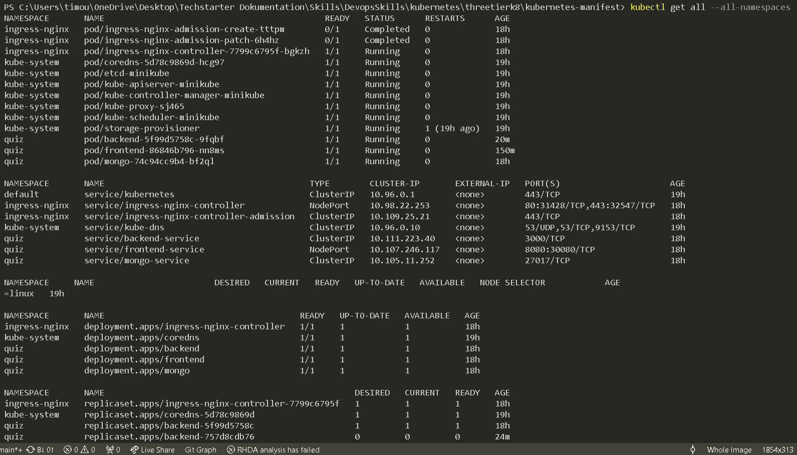
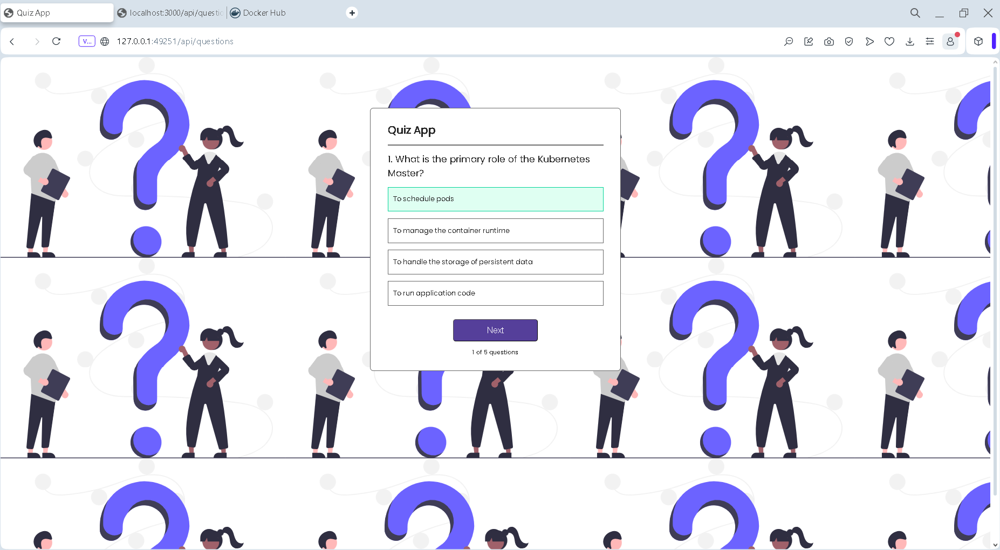
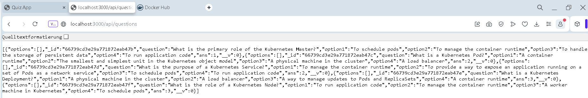

<h2>  Architecture Diagramm <h2>

<h2> Project introduction <h2>

End-to-End DevSecOps Kubernetes Project ! In this comprehensive project, i go through the process of setting up a robust Three-Tier architecture on AWS using Kubernetes, DevOps best practices, and security measures. This project aims to provide hands-on experience in deploying, securing, and monitoring a scalable application environment.

<h1> Reminder </h1>

Started it again locally. Lost the live ones. And Took some pictures about the application. About the code its just a simple Quiz application which fetches Data from a mongo db Table :) in a k8 cluster.

<h1> In Gitops (EKS) <h1>

<h2> Pics <h2>

